# Prepare-Data-for-ML-APIs-on-Google-Cloud

This is a documentation of the steps I took to complete the `Prepare Data for ML APIs on Google Cloud: Challenge Lab` to earn the [Google Smart Analytics Skill Badge](https://www.credly.com/badges/1724464a-bc68-4d2c-b4ff-8e68b9c7e0e7/public_url).


## Challenge Scenario
As a junior data engineer in Jooli Inc. and recently trained with Google Cloud and a number of data services you have been asked to demonstrate your newly learned skills. You are expected to have the skills and knowledge for these tasks so no step-by-step guides are provided.

The team has asked you to complete the following tasks. 


## Task 1: Run a Dataflow job using a Template

This task requires you to use the Dataflow batch template `Text Files on Cloud Storage to BigQuery` to transfer data from a Cloud Storage bucket (gs://cloud-training/gsp323/lab.csv) to a BigQuery table. 

The following steps are needed to correctly configure the Dataflow job.


### Step 1: Add storage admin permission using console.

The `storage.admin` permission is required to configure this dataflow job. So add the permission if your compute engine service account does not have that permission using the following steps:

1. In the Google Cloud console, on the Navigation menu , select `IAM & Admin` > `IAM`.

1. Select Add Another Role, then search for the storage admin role. Add as shown and click save:

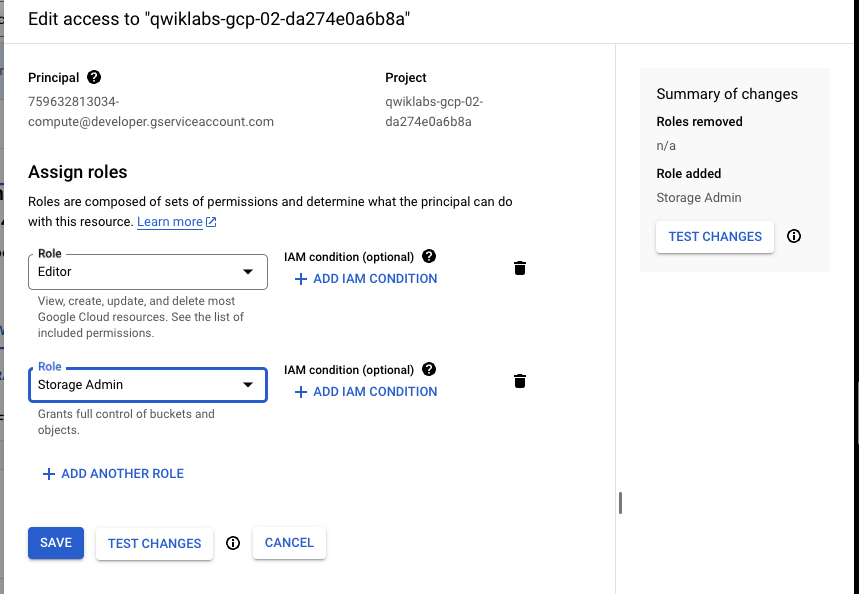


### Step 2: Create BQ Dataset

Run the following code on the terminal to create the BigQuery dataset that will hold the data transfered by the datalow pipeline.

`Bq mk <table name provided>`

### Step 3: Create the BQ Table.

First we need to get the BigQuery table schema provided to create the output table. The table scheme is provided in a cloud storage location. 

You can access the schema by running the following code on your terminal:

```
gsutil cat gs://cloud-training/gsp323/lab.schema
```
The result should look like this:

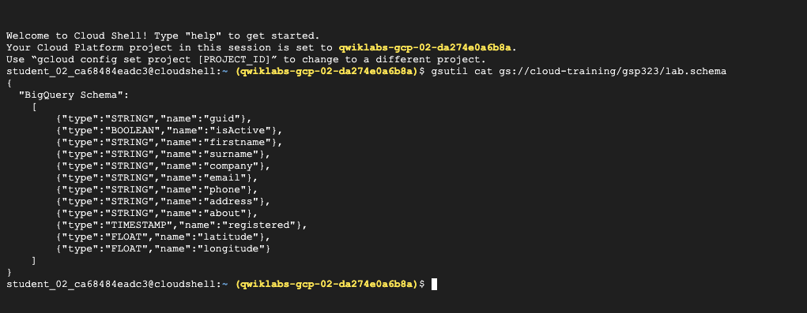

Copy the schema from the terminal and complete the table creation using the following steps:

1. Go back to the console and select the `dataset` that you created under BigQuery. 
1. Select `create table` to create the required table using the table name provided.
1. Uncheck the auto-schema option so you can use the copied table schema instead.
1. Paste the copied schema into the schema textbox while creating the table.


### Step 4: Create a Dataflow job on the console.
 The configuration information required to create the dataflow table is shown below:

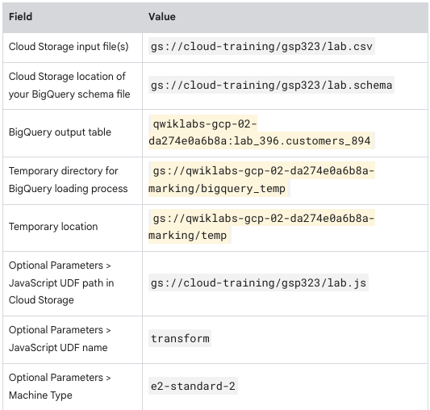

Go to the Dataflow option under Navigation and Select `CREATE JOB FROM TEMPLATE`.

Type `Text Files on Cloud Storage to BigQuery` into the search box and select it.

Complete the pipeline set up using information in the configuration table.

Wait for the data flow job creation to be completed. The status should say succeed on the console as shown below:

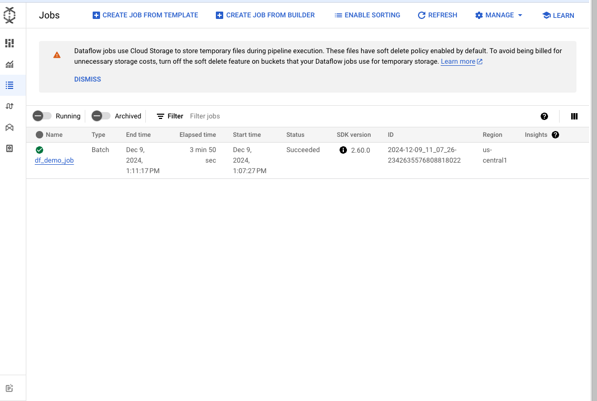

The pipeline is automatically started and the graph visualizer becomes visible after sometime. 

Wait for all the pipeline steps to be completed to signal the end of the task. The dataflow task graph will look like this:

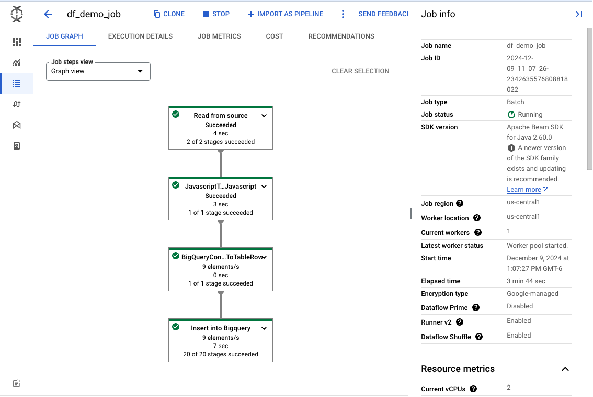


## Run a Simple Dataproc Job

This taks requires you to run an example Spark job using Dataproc.

### Step 1: Create the DataProc cluster.

1. First create a cluster using the configuration information provided in the table. Remember to uncheck the `Configure all instances to have only internal IP addresses` option. 

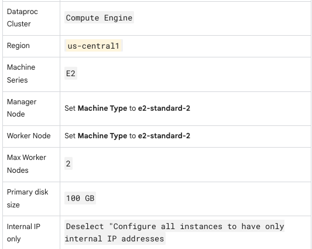

2. Wait for the cluster creation to be complete. Status should say `Running` as shown:

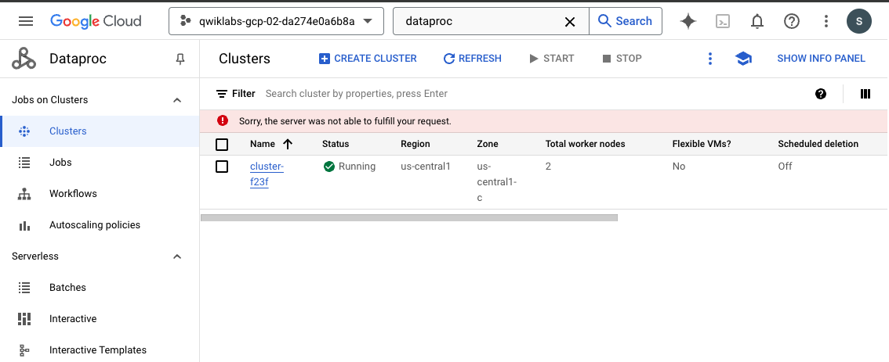

3. Then go to `Compute Engine` > `VMs` and select the first created cluster compute engine.

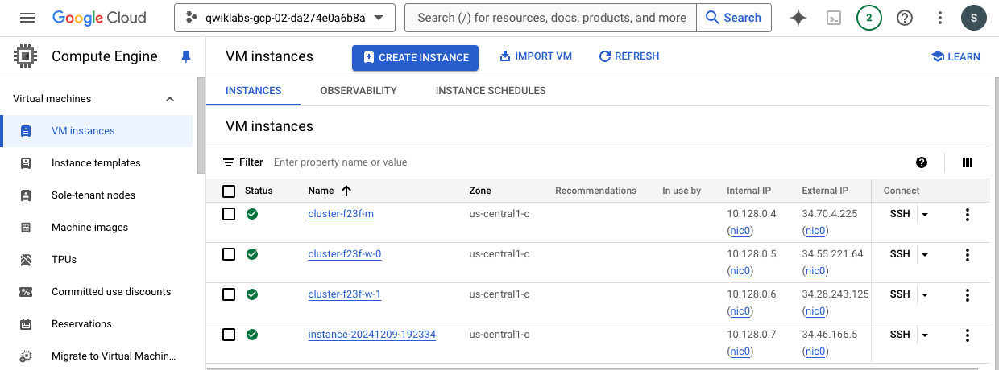


### Step 2: Copy files from cloud storage into HDFS on the Cluster VM.

Copy the /data.txt file into hdfs on the VM by running the following code in the ssh terminal environment.

```
hdfs dfs -cp gs://cloud-training/gsp323/data.txt /data.txt
```

### Step 3: Create and run the Dataproc job from the Console.

Here is the dataproc task configuration provided for the task.

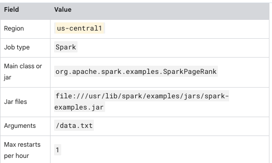

Return to the console and use the configuration table parameters to submit the Dataproc job.

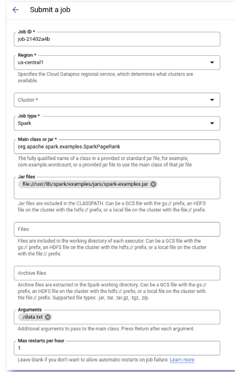

Dataproc outputs a log inside the console. 

Wait until the log status reads `Output is complete` as shown below to finalise the dataproc task.

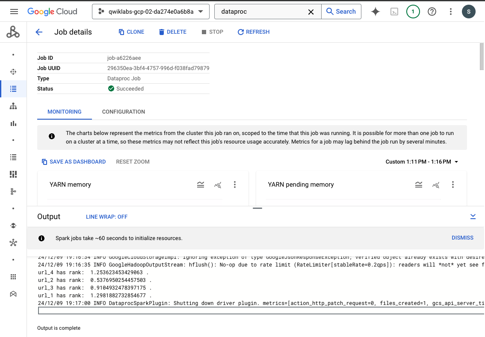


## Google cloud Speech-to text API

This task requires the use of the `Google Cloud Speech-to-Text API` to analyze the audio file `gs://cloud-training/gsp323/task3.flac`. 

Once the file is analyzed, upload the resulting file to: `gs://qwiklabs-gcp-02-da274e0a6b8a-marking/task3-gcs-936.result`.


### Step 1: Create an API key
To create an API key, 
1. Click `Navigation menu` > `APIs & services` > `Credentials`.
1. Then click Create credentials.
1. In the drop down menu, select API key.
1. Copy the key you just generated and click Close.


### Step 2: Create a linux based Virtual Machine for running the request.
1. Click `Navigation menu` > `Compute Engines` > `VMs`. 
1. Then choose `Create Instance`.
1. Select the linux OS and use default values to create a linux machine.

The list of VMs should like this if properly created.


### Step 3:. SSH into the created linux machine.

`<linux_VM-name>` > `SSH` .

### Step 4: Add API key to ENV variable.
```
export API_KEY=<YOUR_API_KEY>
```

### Step 5: Create the request file.
```
touch request.json
```

### Step 6: Open the request file.
```
nano request.json
```

### Step 7: Add the following code to the request file:
```
{
  "config": {
      "encoding":"FLAC",
      "languageCode": "en-US"
  },
  "audio": {
      "uri":"gs://cloud-training/gsp323/task3.flac"
  }
}
```
Remember to update the uri with the actual cloud speech location provided.

Press control + x and then y and click enter to close the request.json file.


### Step 8: Call the Speech-to-Text API and save the response to a file.
```
curl -s -X POST -H "Content-Type: application/json" --data-binary @request.json \
"https://speech.googleapis.com/v1/speech:recognize?key=${API_KEY}" > result.json
```


### Step 9: Inspect result file
```
cat result.json
```

The result should look like this on the terminal:

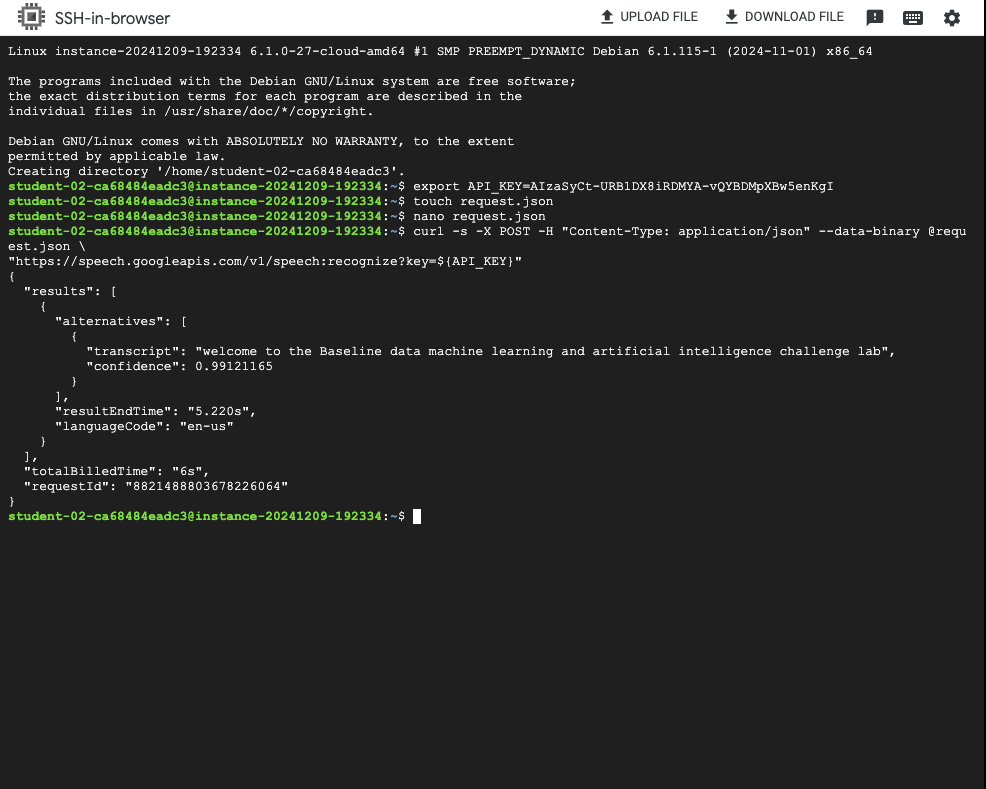


### Step 1: Upload the result file to the speech cloud location provided.
``` 
gsutil cp result.json gs://qwiklabs-gcp-02-da274e0a6b8a-marking/task3-gcs-936.result 
```


## Cloud Natural Language API

This task requires the use of the Cloud Natural Language API to analyze a sentence from some text about Odin. 

The text to be analyzed is "Old Norse texts portray Odin as one-eyed and long-bearded, frequently wielding a spear named Gungnir and wearing a cloak and a broad hat." 

Once the text is analyzed, the resulting file should be uploaded to: gs://qwiklabs-gcp-02-da274e0a6b8a-marking/task4-cnl-501.result.

The following steps were taken to complete the task:

Start Cloud Shell and run the following code on the terminal:


### Step 1: Set project ENV variable. 

```
export GOOGLE_CLOUD_PROJECT=$(gcloud config get-value core/project)
```

### Step 2: Create a new service account.
```
gcloud iam service-accounts create my-natlang-sa \
  --display-name "my natural language service account"
```

### Step 3: Create Service account key and save to key.json file
```
gcloud iam service-accounts keys create ~/key.json \
  --iam-account my-natlang-sa@${GOOGLE_CLOUD_PROJECT}.iam.gserviceaccount.com
```

### Step 4: Set Google_APPLICATION_CREDENTIALS environment variable to the full path of the credential json file that you created.

```
export GOOGLE_APPLICATION_CREDENTIALS="/home/USER/key.json"
```


### Step 5: SSH into the linux Compute Engine created in Task 3.


### Step 6: Run the NLP analysis request and save results to a file.
```
gcloud ml language analyze-entities --content="Old Norse texts portray Odin as one-eyed and long-bearded, frequently wielding a spear named Gungnir and wearing a cloak and a broad hat."  > result.json
```

### Step 7: Preview result on the termimal.
```
cat result.json
```


### Step 8: Upload result file to the specified cloud storage location.
``` 
gsutil cp result.json gs://qwiklabs-gcp-02-da274e0a6b8a-marking/task4-cnl-501.result 
```

